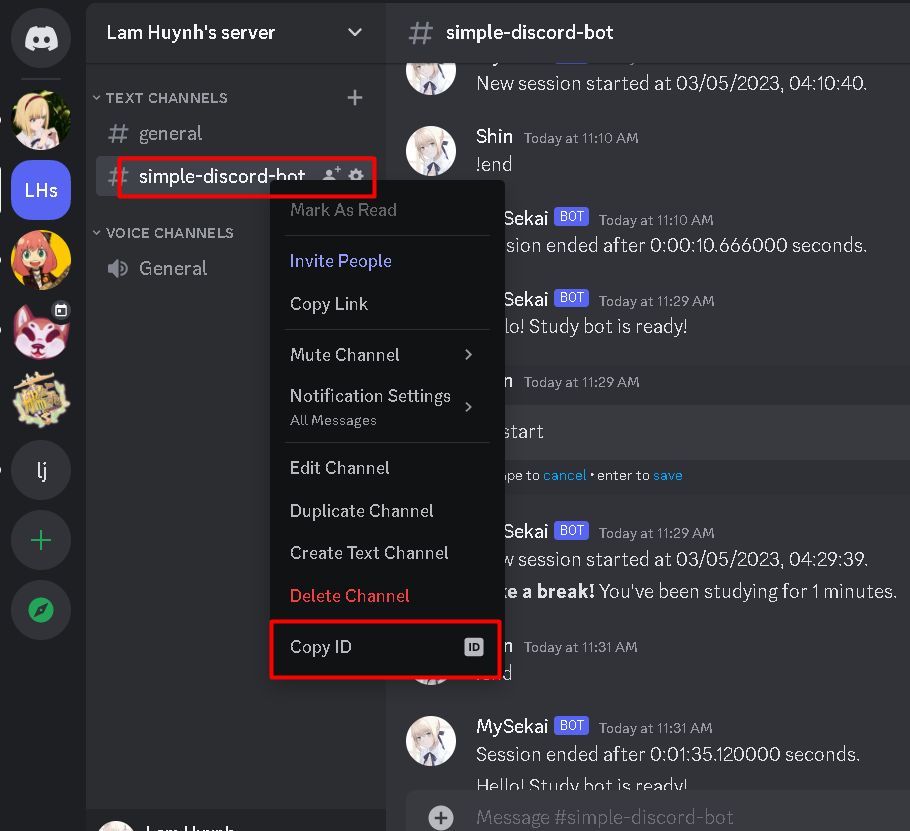

CREATE A SAMPLE BOT

Step 1: Access to https://discord.com/developers/applications to create new Application

Step 2: Add bot

Step 3: Generate URL link to share it to others!

Step 4: If you want to your bot access to orthers server, Just send URL link that generated to them. They will approve your bot can access to their server
https://discord.com/api/oauth2/authorize?client_id=1081803990989275248&permissions=8&scope=bot

Step 5: After your bot can access to orthers server, you want to your bot access to specified channel. Coppy Channel ID:

Step 6: Another thing you want to do if you're working with Discord as a developer is turn on developer mode
Click user's setting > advanced

Step 7: Enable Privileged Gateway Intents

And coding ...

Reference: https://discordpy.readthedocs.io/en/stable/